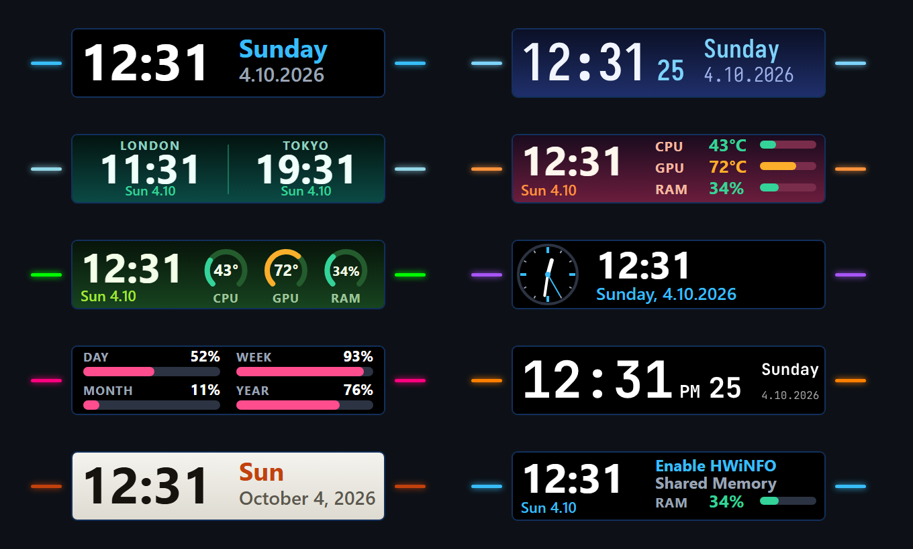

# Elemental Infobar – Stream Deck Neo infobar plugin

Turns the infobar of the **Stream Deck Neo** (the small screen between the two touch points) into a clock, world clock, analog clock, dashboard and more. Colors, themes, fonts and the language of weekday / month names are up to you, and you can color the two lights next to the infobar.



*Example infobars with sample values: clock, clock with seconds in a built-in font, two time zones, clock with readings, dashboard, analog clock, progress, 12-hour clock in English, a light theme, and the message shown when HWiNFO Shared Memory is off. The colored bars on both sides stand for the side lights.*

## Requirements

- Stream Deck Neo and Stream Deck software **7.6** or newer (earlier versions cannot draw on the infobar)
- Windows 10/11
- For CPU / GPU readings only: [HWiNFO](https://www.hwinfo.com/) (the free version is enough) running in *Sensors* mode with **Shared Memory Support** enabled. RAM usage and all clock modes work without it.

## Install and set up

1. Download `com.elemental.infobar.streamDeckPlugin` from the [latest release](../../releases/latest) and double-click it.
2. *(Only for the readings modes)* In HWiNFO open *Settings* and enable **Shared Memory Support** (once).
3. In the Stream Deck app drag **Infobar** (category **Elemental Infobar**) onto the infobar of the Neo preview – the wide rectangle between the touch points. This replaces the built-in *Digital Time* action on that page.
4. Pick a mode and tweak it in the settings.

> The free version of HWiNFO switches Shared Memory off after about 12 hours. When that happens the readings show **Enable HWiNFO Shared Memory** – just enable it again and the data comes back by itself.

Messages shown in the readings modes instead of a value:

| Message | Meaning |
| --- | --- |
| **Enable HWiNFO Shared Memory** | The option is off or has expired |
| **Start HWiNFO** | HWiNFO is not running |
| **--** | HWiNFO is running, but no matching sensor was found |

## Modes

| Mode | What it shows |
| --- | --- |
| Clock | Big time, weekday and date; optional seconds |
| Two time zones | Two clocks side by side with city labels |
| Clock + readings | Clock plus CPU / GPU temperature and RAM usage with small bars |
| Dashboard | Clock plus gauge rings for CPU, GPU and RAM |
| Analog clock | Analog face with hour, minute and (optional) second hand, plus digital time and date |
| Progress | How far through the day / week / month / year you are |

## Options

- **Date language**: system language, English, Polish, German, French, Spanish, Italian, Czech, Portuguese, Dutch or Ukrainian (weekday and month names)
- **Time zone** from a list or any IANA name (e.g. `Europe/Vienna`); 24 h or 12 h; seconds; long / short / hidden weekday; eight date formats; capitalization of names
- **Themes**: Black, Midnight, Aurora, Sunset, Forest, Mono, Paper, plus your own accent color
- **Fonts**: Segoe UI, Arial, Bahnschrift, Tahoma and Trebuchet MS (these all render at a similar size), and two monospaced fonts built into the plugin that need no installation – JetBrains Mono and Iosevka. A built-in font is used only for text it has all the glyphs for; anything else is drawn in a system font.
- **Side lights** (the two lights next to the infobar): automatic, custom color, rainbow, pulsing, by CPU / GPU temperature, by time of day, by weekday, or flashing red when something runs too hot. The settings panel offers a palette of 12 fully saturated colors, the only ones the lights accept (picking one switches on the custom color), and a live preview of both lights. The plugin sets the lights through the color of a thin 2 px line along the bottom edge of the picture (thinner or darker lines do not work; you only see it in the app preview, not on the device), so nothing else on the infobar changes color. The lights cannot be switched off, and white, gray, black and pale shades are ignored, which is why only saturated colors are offered.
- **Refresh rate**: from 1 to 20 times per second (a smooth sweeping second hand on the analog clock); readings can be updated every 1, 2, 5 or 10 seconds
- Readings: choose which of CPU / GPU / RAM to show and °C / °F
- Language of the settings panel: English or Polish (Auto follows Stream Deck, or choose it yourself)

## Supported hardware

Readings are matched by their HWiNFO labels, with priority lists for Intel (`CPU Package`), AMD (`CPU (Tctl/Tdie)`, `CPU PPT`) and for NVIDIA, AMD and Intel graphics (`GPU [#N]` sensors); the first graphics card is shown. RAM usage comes from the operating system. Developed and tested on Intel + NVIDIA; AMD and Radeon / Intel GPUs are supported through HWiNFO sensor names and are less tested. If a reading shows **--** although HWiNFO shows the sensor, the label probably differs – please open an issue and include the sensor name, or see `$rules` in `com.elemental.infobar.sdPlugin/bin/hwinfo-shm.ps1`.

## Good to know

- The infobar is not a button: it only displays. The two touch points next to it are not programmable (they only switch pages), but their lights can be colored – see **Side lights**.
- The plugin draws the whole infobar as one 232 × 50 px image, so colors and fonts are the same everywhere.
- For the readings modes (and the temperature-based side lights) the plugin starts a small `powershell.exe` helper to read HWiNFO's shared memory. Locked-down PCs or aggressive antivirus software may block it.
- Windows only.
- Nothing is sent over the network. The only connection is an optional local read from `localhost:8085` (LibreHardwareMonitor) used as a CPU fallback.

## Development

```
npm install
npm run deploy      # build + restart the plugin (Stream Deck restarts it by itself)
npm run typecheck
npx streamdeck pack com.elemental.infobar.sdPlugin --output dist --force
```

- `src/clock.ts` – time zones, locale-aware names, date formats
- `src/modes.ts` – SVG rendering of every mode and theme
- `src/led.ts` – color of the side lights
- `src/plugin.ts` – the infobar action, timers, sensor polling
- `src/glyphs.ts` + `com.elemental.infobar.sdPlugin/fonts/*.json` – built-in fonts drawn as vector paths (generated by `scripts/gen-fonts.mjs` from the @fontsource packages, SIL OFL 1.1)
- `src/metrics.json` – character widths of the system fonts (generated by `scripts/gen-metrics.mjs`)
- `src/sensors.ts` + `com.elemental.infobar.sdPlugin/bin/hwinfo-shm.ps1` – HWiNFO shared memory reader (registry and LibreHardwareMonitor fallbacks for the CPU; RAM from the OS)
- `com.elemental.infobar.sdPlugin/ui/infobar.html` – settings panel

## License

MIT – see [LICENSE](LICENSE). Third-party components bundled with the plugin and their licenses (including the SIL Open Font License of the built-in fonts) are listed in [THIRD-PARTY-NOTICES.txt](THIRD-PARTY-NOTICES.txt).
